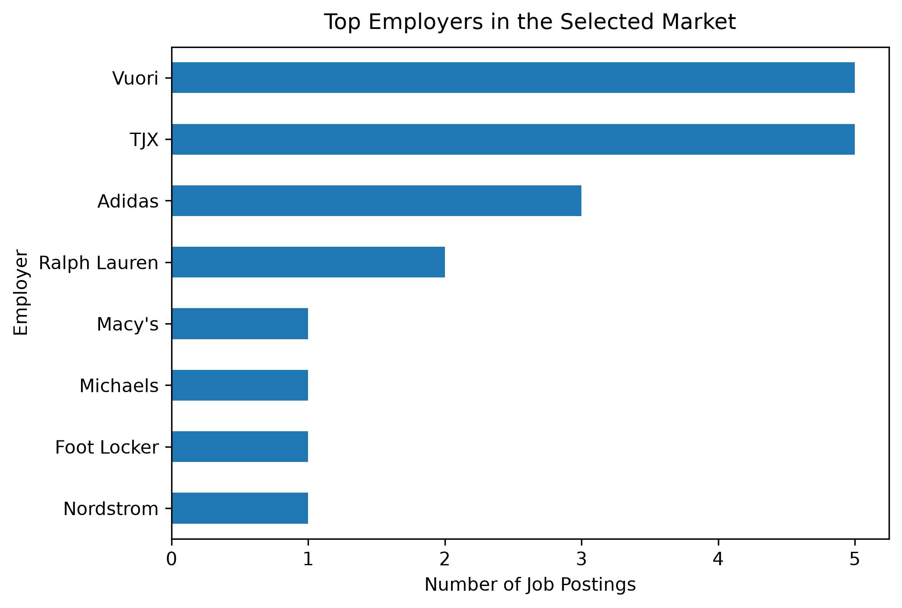
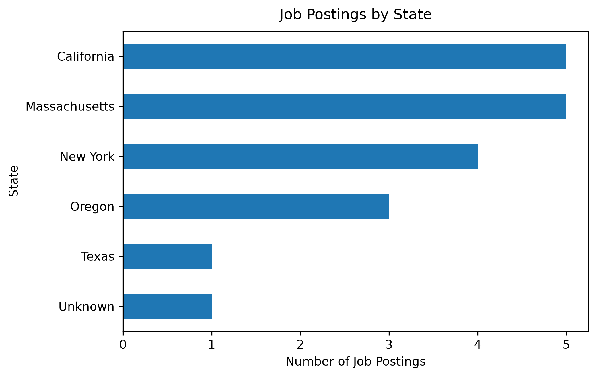

Selected projects from my graduate coursework and analytics work. These projects demonstrate how I use data, analytical methods, and visualization to explore business questions and communicate actionable insights.

::: {.portfolio-card .featured-project}

## Fashion & Apparel Job Market Analysis

### Exploring analytics opportunities in fashion and apparel

Analyzed a targeted sample of analytics-related job postings from fashion and apparel employers to examine hiring patterns, salary information, geographic concentration, work arrangements, and experience requirements.

**Tools:** Python · Pandas · Plotly · PySpark · Quarto · GitHub

::: {.grid}

::: {.g-col-12 .g-col-md-6}

{.project-image fig-alt="Bar chart showing the top employers represented in the fashion and apparel analytics job market dataset."}

:::

::: {.g-col-12 .g-col-md-6}

{.project-image fig-alt="Bar chart showing the geographic distribution of fashion and apparel analytics job postings by state."}

:::

:::

**Analysis included:**

- Employer representation
- Salary ranges
- Geographic distribution
- Remote and hybrid work arrangements
- Experience requirements

The analysis highlighted how opportunities in the selected sample were distributed across employers and locations while also revealing limitations in salary, experience, and work-arrangement reporting. The project demonstrates an end-to-end workflow from data preparation and exploratory analysis to interactive visualization and business interpretation.

[View Project Repository →](https://github.com/zechnschweitzer/ad688-fashion-apparel-evaluation-group7)

:::

::: {.grid}

::: {.g-col-12 .g-col-lg-6 .portfolio-card}

## Corporate 10-K Analysis Using NLP

### Comparing Merck and Johnson & Johnson corporate disclosures

Analyzed Merck and Johnson & Johnson 10-K filings from 2020–2024 using multiple natural language processing approaches to compare corporate disclosures, measure document similarity, and evaluate different text representations.

**Tools:** Python · TF-IDF · Word2Vec · GloVe · FAISS · Machine Learning · RAG

**Analysis included:**

- Text preprocessing and feature engineering
- TF-IDF and document similarity
- Word2Vec and GloVe embeddings
- Machine learning classification
- FAISS vector similarity search
- Retrieval-augmented generation (RAG)

The analysis compared traditional and embedding-based representations, with TF-IDF providing the strongest classification performance among the evaluated approaches. The project also extended the analysis through FAISS-based retrieval and RAG to explore grounded information retrieval from financial disclosures.

:::

::: {.g-col-12 .g-col-lg-6 .portfolio-card}

## Customer Segmentation & Business Analysis

### Identifying customer value, behavior, and retention opportunities

Analyzed Northwind customer and transaction data to understand purchasing behavior, customer value, and differences across customer segments, with the goal of translating behavioral patterns into actionable business insights.

**Tools:** Python · Pandas · Customer Segmentation · Statistical Analysis · Data Visualization

**Analysis included:**

- Customer purchasing behavior
- Revenue and customer value analysis
- Customer segmentation
- At-risk customer identification
- Relationship between customer metrics
- Business recommendations

The analysis identified distinct customer groups and highlighted customers showing potential retention risk. It also examined relationships between customer behavior and business value to support more targeted customer strategies and data-informed decision-making.

:::

:::

## Explore More

Additional projects, coursework, and analytics work are available on my GitHub profile.

[Explore my GitHub →](https://github.com/anroy-3007)